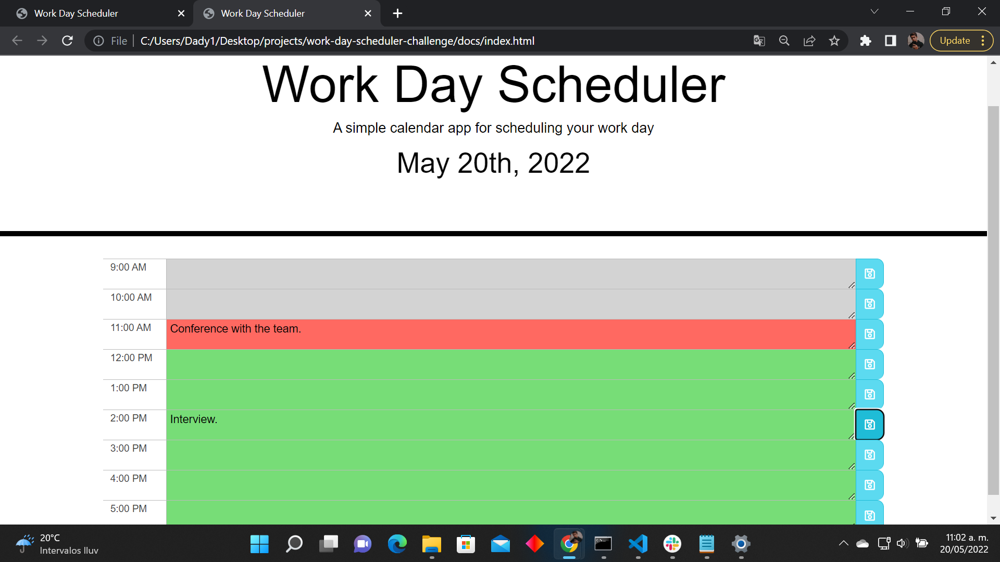
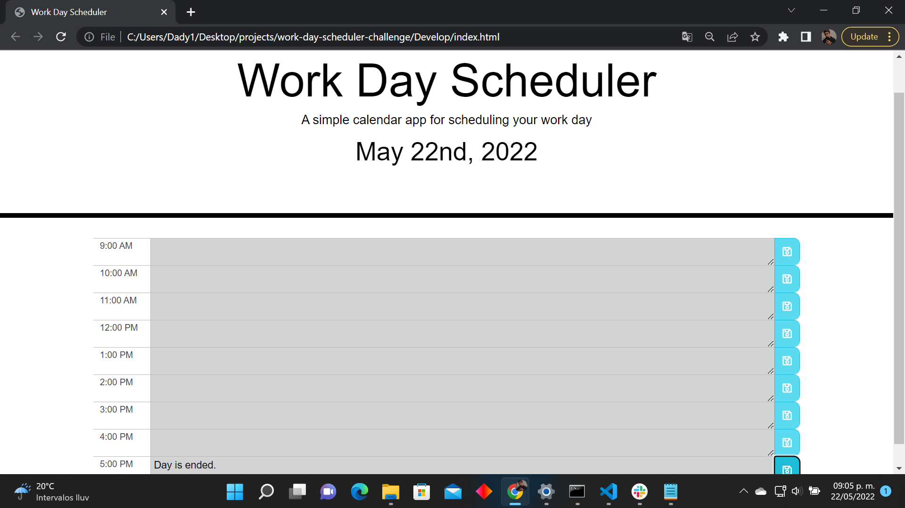

# Work Day Scheduler Challenge

## Purpose
This website is build for all the users that needs to administrate their time during business hours, it is very easy and comfortable to use because it will not only let you registrate all your activities, this application will also let you know when you are in time or not. The scheduler will be marked with three different colors representing the status of your activities; gray is for those that have been passed of time, red is for the current hour in which the user is in and green is for the availability of your next business hours.

## Built With
* HTML
* CSS
* JavaScript

## Website
https://israel2800.github.io/work-day-scheduler-challenge/

## GitHub Repository
https://github.com/Israel2800/work-day-scheduler-challenge

## Screenshots

## Contribution
Made with ❤️ by [Israel Aguilar]

### ©️2022 Work Day Scheduler Challenge
